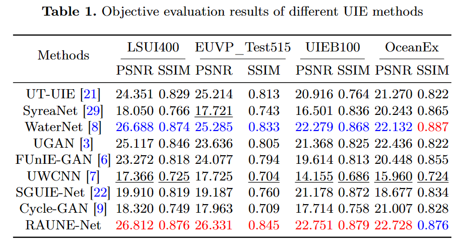

# RAUNE-Net
A Residual and Attention-Driven Underwater Image Enhancement Method.

## 🎯Notice


## 🤗Abstract
> Underwater image enhancement (UIE) poses challenges due to distinctive properties of the underwater environment, including low contrast, high turbidity, visual blurriness, and color distortion. In recent years, the application of deep learning has quietly revolutionized various areas of scientific research, including UIE. However, existing deep learning-based UIE methods generally suffer from issues of weak robustness and limited adaptability. In this paper, inspired by residual and attention mechanisms, we propose a more reliable and reasonable UIE network called *RAUNE-Net* ([rɔ:ni net]) by employing residual learning of high-level features at the network's bottle-neck and two aspects of attention manipulations in the down-sampling procedure. Furthermore, we have collected and created two datasets specifically designed for evaluating UIE methods, which contains different types of underwater distortions and degradations. The experimental validation demonstrate that our method obtains promising objective performance and consistent visual results across various underwater image test-sets compared to other eight UIE methods.

## 🛖Datasets
We used 1 dataset for training and 4 full-reference datasets and 3 non-reference datasets for testing. You can download these datasets by clicking links below.

### Training Datasets
- LSUI3879
    - 3879 pairs of images randomly selected from LSUI [13].
    - [🔗GoogleDrive](https://drive.google.com/file/d/19UGfKpgqNiue3SD765xwy-P5dsqrAk8X/view?usp=sharing)

### Test Datasets
#### Full-reference Datasets
- LSUI400
    - 400 pairs of images remained in LSUI [13].
    - [🔗GoogleDrive](https://drive.google.com/file/d/1p_WSipuOnsW_HyKU1IZoI-iv1BPqbHN_/view?usp=sharing)
- UIEB100
    - 100 pairs of images randomly selected from UIEB [8].
    - [🔗GoogleDrive](https://drive.google.com/file/d/1QcVZbfGiNq3qCU2SrciBizQdCHm3L7ed/view?usp=sharing)
- EUVP_Test515
    - 515 pairs of testing images from EUVP [6].
    - [🔗GoogleDrive](https://drive.google.com/file/d/1Jy9AGn5MgPyyZsQgtbD1voEx7IsYlWpx/view?usp=sharing)
- OceanEx
    - We gathered 40 high-quality underwater images from the official website of [NOAA Ocean Exploration](https://oceanexplorer.noaa.gov/image-gallery/welcome.html). Then, we applied CycleGAN to add underwater distortions and degradation styles to these images, making them the samples to be enhanced, while keeping the original high-quality images as reference images.
    - [🔗GoogleDrive](https://drive.google.com/file/d/1I9u8lUvPTsk9OXOcqGTKkWu0uFfjKnQM/view?usp=sharing)
#### Non-reference Datasets
- U45
    - 45 real-world images from [10].
    - [🔗GoogleDrive](https://drive.google.com/file/d/1AUBv8gQZGvd8YDWuEexpXq9dOWJ0jCAT/view?usp=sharing)
- RUIE_Color90
    - 90 real-world images from RUIE [12], which contains 3 types of color cast (i.e., greenish, blue-greenish, and bluish).
    - [🔗GoogleDrive](https://drive.google.com/file/d/1VX7Y7PjqVN3a32i4O8OSD1LprJrtwl71/view?usp=sharing)
- UPoor200
    - UPoor200 is a dataset we collected and created, which consists of 200 real-world underwater images with poor visual quality. It includes distortions such as blue-green color cast, low lighting, blurriness, noise, and other types of distortions.
    - [🔗GoogleDrive](https://drive.google.com/file/d/1BxUMLfx0VVX2odrjfcTHJ5P-OBsyvvLf/view?usp=sharing)

## 🎲Experimental Results

### Experiments on Different UIE Methods
we compared RAUNE-Net with eight other UIE methods (i.e., UT-UIE [13], SyreaNet [17], WaterNet [8], UGAN [3], FUnIE-GAN [6], UWCNN [7], SGUIE-Net [14], Cycle-GAN [9]).

#### Objective Evaluation Results

#### Subjective Evaluation Results


## 🕹️Test
### Pretrained Models
We provide pretrained models for testing `RAUNE-Net`, `WaterNet`, `UGAN`, and `FUnIE-GAN`. Please click [🔗this link](https://drive.google.com/drive/folders/1pjEh6s6-a3p7qBtkONSlYLmKrfgD6rBk?usp=sharing) to download them. After the download is complete, please unzip and put pretrained weights into the `pretrained` folder. Please see [👉here](./pretrained/README.md) to organize the directory structure for testing.

#### The highest values of objective metrics tested for **RAUNE-Net**

| Epoch | Dataset | PSNR | SSIM |
| --- | --- | --- | --- |
| 85 | LSUI400 | 26.812 | 0.876 |
| 90 | EUVP_Test515 | 26.331 | 0.845 |
| 95 | UIEB100 | 22.751 | 0.879 |
| 90 | OceanEx | 22.728 | 0.876 |

#### The highest values of objective metrics tested for **WaterNet**

| Epoch | Dataset | PSNR | SSIM |
| --- | --- | --- | --- |
| 85 | LSUI400 | 26.688 | 0.874 |
| 90 | EUVP_Test515 | 25.285 | 0.833 |
| 80 | UIEB100 | 22.279 | 0.868 |
| 50 | OceanEx | 22.132 | 0.887 |

#### The highest values of objective metrics tested for **UGAN**

| Epoch | Dataset | PSNR | SSIM |
| --- | --- | --- | --- |
| 85 | LSUI400 | 25.117 | 0.846 |
| 85 | EUVP_Test515 | 23.636 | 0.805 |
| 90 | UIEB100 | 21.368 | 0.825 |
| 60 | OceanEx | 22.436 | 0.822 |

#### The highest values of objective metrics tested for **FUnIE_GAN**

| Epoch | Dataset | PSNR | SSIM |
| --- | --- | --- | --- |
| 85 | LSUI400 | 23.272 | 0.818 |
| 95 | EUVP_Test515 | 24.077 | 0.794 |
| 85 | UIEB100 | 19.614 | 0.813 |
| 50 | OceanEx | 20.448 | 0.855 |

### Test Examples

#### (1) Test of RAUNE-Net

Single Epoch Test:
```bash
python test_raunenet.py \
    --name test \
    --checkpoint_dir pretrained \
    --epoch 95 \
    --data_dir <PATH_TO_YOUR_TEST_DATASET> \
    --test_name <YOUR_TESTSET_NAME> \
    --num_down 2 \
    --num_blocks 30 \
    --result_dir results/raunet_test01
```

Multiple Epochs Test:
```bash
bash scripts/test_raunenet.sh
# name: test
# checkpoint_dir: pretrained
# num_down: 2
# num_blocks: 30
# use_att_up: false
```

Multiple Epochs Test and Assessment:
```bash
bash scripts/test_assess_raunenet.sh
# name: test
# checkpoint_dir: pretrained
# num_down: 2
# num_blocks: 30
# use_att_up: false
```

#### (2) Test of WaterNet
Single Epoch Test:
```bash
python test_waternet.py \
    --name test \
    --checkpoint_dir pretrained \
    --data_dir <PATH_TO_YOUR_TEST_DATASET> \
    --epoch 95 \
    --test_name <YOUR_TESTSET_NAME> \
    --result_dir results/waternet01
```

Multiple Epochs Test:
```bash
bash scripts/test_waternet.sh
# name: test
# checkpoint_dir: pretrained
```

Multiple Epochs Test and Assessment:
```bash
bash scripts/test_assess_waternet.sh
# name: test
# checkpoint_dir: pretrained
```

#### (3) Test of UGAN
Single Epoch Test:
```bash
python test_ugan.py \
    --name test \
    --checkpoint_dir pretrained \
    --data_dir <PATH_TO_YOUR_TEST_DATASET> \
    --epoch 95 \
    --test_name <YOUR_TESTSET_NAME> \
    --result_dir results/ugan01
```

Multiple Epochs Test:
```bash
bash scripts/test_ugan.sh
# name: test
# checkpoint_dir: pretrained
```

Multiple Epochs Test and Assessment:
```bash
bash scripts/test_assess_ugan.sh
# name: test
# checkpoint_dir: pretrained
```

#### (4) Test of FUnIE-GAN
Single Epoch Test:
```bash
python test_funiegan.py \
    --name test \
    --checkpoint_dir pretrained \
    --data_dir <PATH_TO_YOUR_TEST_DATASET> \
    --epoch 95 \
    --test_name <YOUR_TESTSET_NAME> \
    --result_dir results/funiegan01
```

Multiple Epochs Test:
```bash
bash scripts/test_funiegan.sh
# name: test
# checkpoint_dir: pretrained
```

Multiple Epochs Test and Assessment:
```bash
bash scripts/test_assess_funiegan.sh
# name: test
# checkpoint_dir: pretrained
```

### Calculate `PSNR` and `SSIM`
We provide a python program in command-line interface (CLI) to calculate `PSNR` and `SSIM`. You can see example below to use this simple tool.

```bash
# The input_dir may like 'results/raunet_test01/LSUI400/single/predicted/'
python calc_psnr_ssim.py \
    --input_dir <YOUR_ENHANCED_IMAGES_DIRECTORY> \
    --refer_dir <YOUR_REFERENCE_IMAGES_DIRECTORY> \
    --output_dir <YOUR_OUTPUT_DIRECTORY> \
    --resize \
    --width 256 --height 256
```

## 🪄Training
We provide four programs for training with command-line interface. They are:
- [train_raunenet.py](./train_raunenet.py)
- [train_waternet.py](./train_waternet.py)
- [train_ugan.py](./train_ugan.py)
- [train_funiegan.py](./train_funiegan.py)

Please see them in details.

For example, you can train a model of RAUNE-Net like this:
```bash
python train_raunenet.py \
    --cfg_file configs/train_lsui3879.yaml \
    --name LSUI3879_PCONT1_SSIM1_SCONT1 \
    --num_epochs 100 \
    --batch_size 8 \
    --lr 0.0001 \
    --pcont_weight 1 \
    --ssim_weight 1 \
    --scont_weight 1 \
    --seed 2023 \
    --num_down 2 \
    --num_blocks 3
```

## 🤔Q&A
If you have any question about this project, please contact `fansuregrin`(or `Wangzhen Peng`) through **wangzhenpeng@stu.ouc.edu.cn** or **pwz113436@gmail.com**! Btw, any pull request is welcome if you are interested in this project:)

## 📔References
[3] Fabbri, C., Islam, M.J., Sattar, J.: Enhancing underwater imagery using generative adversarial networks. In: 2018 IEEE International Conference on Robotics and Automation (ICRA). pp. 7159–7165. IEEE (2018)

[6] Islam, M.J., Xia, Y., Sattar, J.: Fast underwater image enhancement for improved visual perception. IEEE Robotics and Automation Letters 5(2), 3227–3234 (2020)

[7] Li, C., Anwar, S., Porikli, F.: Underwater scene prior inspired deep underwater image and video enhancement. Pattern Recognition 98, 107038 (2020)

[8] Li, C., Guo, C., Ren, W., Cong, R., Hou, J., Kwong, S., Tao, D.: An underwater image enhancement benchmark dataset and beyond. IEEE Transactions on Image Processing 29, 4376–4389 (2019)

[9] Li, C., Guo, J., Guo, C.: Emerging from water: Underwater image color correction based on weakly supervised color transfer. IEEE Signal processing letters 25(3), 323–327 (2018)

[10] Li, H., Li, J., Wang, W.: A fusion adversarial underwater image enhancement network with a public test dataset. arXiv preprint arXiv:1906.06819 (2019)

[12] Liu, R., Fan, X., Zhu, M., Hou, M., Luo, Z.: Real-world underwater enhancement: Challenges, benchmarks, and solutions under natural light. IEEE Transactions on Circuits and Systems for Video Technology 30(12), 4861–4875 (2020)

[13] Peng, L., Zhu, C., Bian, L.: U-shape transformer for underwater image enhancement. IEEE Transactions on Image Processing (2023)

[14] Qi, Q., Li, K., Zheng, H., Gao, X., Hou, G., Sun, K.: Sguie-net: Semantic attention guided underwater image enhancement with multi-scale perception. IEEE Transactions on Image Processing 31, 6816–6830 (2022)

[17] Wen, J., Cui, J., Zhao, Z., Yan, R., Gao, Z., Dou, L., Chen, B.M.: Syreanet: A physically guided underwater image enhancement framework integrating synthetic and real images. arXiv preprint arXiv:2302.08269 (2023)

